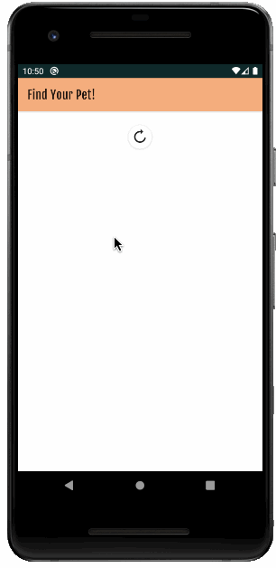

# Find Your Pet App :dog:
Simple app to display information of owners and their pets. 
Assignment. 

## Frameworks, techniques and patterns
* HILT framework 
* Retrofit and Jackson
* LiveData and Transformations
* Threading
* Google Room database 
* Google Maps
* Viewmodels

## About Find your Pet App
Information about owners and their pets are retrieved with a web service and stored in a database. Pets can be missing or not, but their location is always available.
The data from the database is displayed as Live Data in lists, a collapsible toolbar and a Google Map fragment. When a marker on the map is clicked, a toast with the owners or pets name appears.

## Screencast Example
Screencast of the app running on Android emulator

